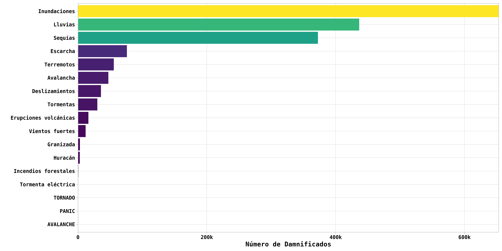

# :bar_chart: :chart_with_upwards_trend: :guatemala: **Guatemala Forecast Based Financing**

Este proyecto tiene como objetivo analizar, modelar,identificar, comunicar y tomar acciones y medidas de prevención frente a los diferentes pronósticos metereológicos emitido por las respectivas instituciones técnico científica, esto con la finalidad de poder llevar ayuda humanitaria días antes de la ocurrencia de un determinado fenómeno a los municipios más vulnerables o con altos índices de riesgo frente a las principales amanezanas de mayor ocurrencia e impacto en el país de Guatemala.

En este repositorio encontrarás toda la información y datos disponibles con la cual se ha está trabajando, de igual manera encontrás gráficos, mapas y reportes estadísticos que pueden ayudarte a entender más sobre la caracterización e identificación de los componentes del riesgo.

Finalmente, este proyecto se irá actualizando según los nuevos datos o reportes de emergencias emitidos por las respectivas 
autoriades encargadas de la temática.

# Gráficos 

# Mapas
 
 

## Referencias utilizadas:
- **DESINVENTAR**: <https://www.desinventar.net/DesInventar/main.jsp>
- **QGIS** : <https://qgis.org/it/site/>
- **R y Rstudio** : <https://cran.r-project.org/> , <https://rstudio.com/>

Todos los datos producidos en el presente proyecto se publican bajo [licencia Creative Commons (CC BY 3.0 IT)](https://creativecommons.org/share-your-work/): Es posible reproducir, distribuir, transmitir y adaptar libremente datos,  también con fines comerciales, siempre que se cite la **fuente**.

